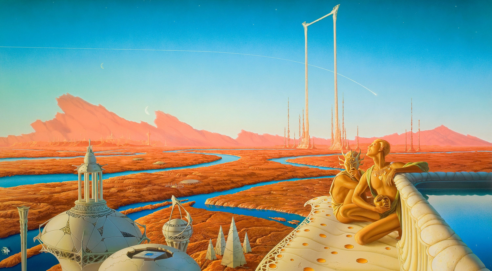

##### A 😲 Wallpaper.
# skullwaves

As a user of WSL (Windows Subsystem for Linux) recently upgraded to WSL2. This repository brings together both configurations and downloaded plugins that make my productivity easier and faster.
Both images and documents of certain importance are also included.

**Warning:** For personal use 😶‍🌫️.

## Vim setup (>=8.2.0) 👨🏾‍💻
---
Requieres [vim](https://www.vim.org/)
- To set my system theme ➡️ [morhetz/gruvbox](https://github.com/morhetz/gruvbox).
- A way to use some motions in vim ➡️ [easymotion/vim-easymotion](https://github.com/easymotion/vim-easymotion).
- A file system explorer for the Vim editor ➡️ [scrooloose/nerdtree](https://github.com/preservim/nerdtree).
- Navigate seamlessly between vim and tmux ➡️ [christoomey/vim-tmux-navigator](https://github.com/christoomey/vim-tmux-navigator).
- Custom pop menu with snippet sopport ➡️ [neoclide/coc.nvim](https://github.com/neoclide/coc.nvim).

### the main aliases in my .bashrc file ヾ(＠⌒ー⌒＠)ノ
~~~ .bashrc
alias c='clear'
alias x='rm-rf'
alias vi='vim'
alias v='vim .
alias z='cd'
alias g='git'
alias gin='git init && commitizen init cz-conventional-changelog --save-dev --save-exact'
~~~

## About me 
---
- [Twitter @skullwaves @sixtuswork18](http://twitter.com/sixtuswork18)
- [ My Company: QuizelCube ](http://www.quizelcube.io)

